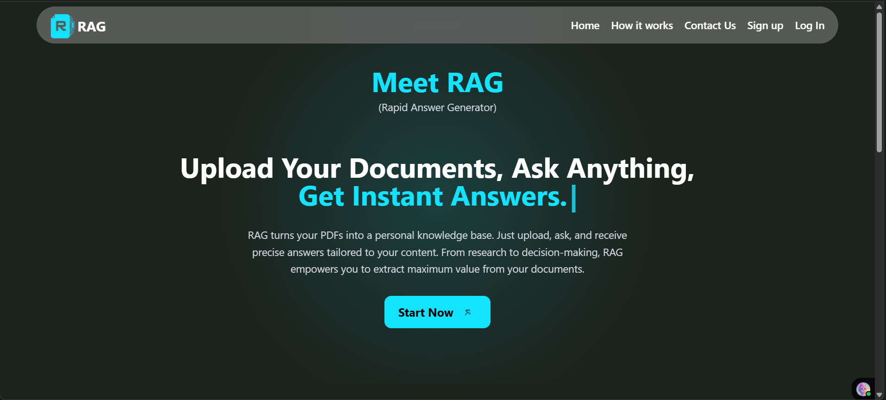

# RAG (Rapid Answer Generator)

## 🚀 Project Overview

RAG (Rapid Answer Generator) is an intelligent web application designed to transform your PDF documents into a personal, queryable knowledge base. Upload your PDFs, ask questions, and receive precise, context-aware answers instantly. Whether for research, study, or decision-making, RAG empowers you to extract maximum value from your documents efficiently.

## ✨ Features

*   **Advanced PDF Processing**: Upload up to two PDF documents (max 5MB each). The system automatically detects and performs OCR on scanned PDFs using `ocrmypdf` to ensure text is always extractable.
*   **Retrieval-Augmented Generation (RAG)**: Documents are chunked, vectorized using Google's embeddings, and stored in a ChromaDB vector store for efficient similarity searches.
*   **Context-Aware Chat**: Ask questions and receive answers based on the content of your uploaded documents. The conversation history is used to maintain context.
*   **Gemini Fallback**: If an answer isn't found within the provided documents, the app seamlessly queries the powerful Google Gemini model for a general knowledge response.
*   **Voice-to-Text Input**: Use the built-in voice search to ask questions hands-free, powered by the browser's Speech Recognition API.
*   **Secure User Authentication**: Robust authentication system with Appwrite, supporting both email/password and Google OAuth for quick and secure access.
*   **Conversation Management**: View, revisit, and delete past conversations. Your chat history is saved and linked to your user account.
*   **Usage Limits**: Implements a daily prompt limit per user to manage resource consumption, which resets every 24 hours.
*   **Fully Responsive UI**: A sleek and modern interface built with React, Tailwind CSS, and shadcn/ui that works beautifully on desktop and mobile devices.

## 🛠️ Tech Stack

The application is built with a modern, full-stack architecture, leveraging powerful tools for both the frontend and backend.

### Frontend

*   **Framework**: React.js
*   **Build Tool**: Vite
*   **Styling**: Tailwind CSS
*   **UI Components**: shadcn/ui
*   **State Management**: Redux Toolkit
*   **Routing**: React Router DOM
*   **Icons**: Lucide React

### Backend

*   **Server**: Flask (Python)
*   **BaaS (Backend as a Service)**: Appwrite
*   **AI/RAG Framework**: LangChain (Python)
*   **AI Model**: Google Gemini API
*   **Vector Database**: ChromaDB
*   **PDF Processing**: PyPDFLoader & `ocrmypdf`

## 🏗️ Architecture

Below is a high-level overview of the RAG application's architecture:


## 📺 Demo Video

Watch a quick demonstration of RAG in action, from setting up to querying your documents:

[](https://screenrec.com/share/U7RV108Ovx)


## 🚀 Getting Started

Follow these instructions to set up and run the RAG application on your local machine.

### Prerequisites

*   Node.js (v18 or higher)
*   Python (v3.9 or higher)
*   npm or Yarn
*   `ocrmypdf` (install via `pip install ocrmypdf` or your system's package manager)

### 1. Clone the Repository

```bash
git clone https://github.com/your-username/rag-project.git
cd rag-project
```

### 2. Backend Setup (Python Flask)

Navigate to the `server` directory:

```bash
cd server
```

Create a Python virtual environment and activate it:

```bash
# On Windows
python -m venv venv
.\venv\Scripts\activate

# On macOS/Linux
python3 -m venv venv
source venv/bin/activate
```

Install the required Python packages:

```bash
pip install -r requirements.txt
```

Create a `.env` file in the `server` directory by copying `.env.sample` and fill in your credentials:

```
# server/.env
FRONTEND_URL="http://localhost:5173"
VITE_APPWRITE_ENDPOINT="https://cloud.appwrite.io/v1"
VITE_APPWRITE_PROJECT_ID="YOUR_APPWRITE_PROJECT_ID"
VITE_APPWRITE_API_KEY="YOUR_APPWRITE_API_KEY"
VITE_APPWRITE_DATABASE_ID="YOUR_APPWRITE_DATABASE_ID"
VITE_APPWRITE_CONVERSATIONS_COLL_ID="YOUR_CONVERSATIONS_COLLECTION_ID"
VITE_APPWRITE_MESSAGES_COLL_ID="YOUR_MESSAGES_COLLECTION_ID"
VITE_APPWRITE_USER_LIMITS_COLL_ID="YOUR_USER_LIMITS_COLLECTION_ID"
GOOGLE_API_KEY="YOUR_GOOGLE_GEMINI_API_KEY"
```

Run the Flask server:

```bash
flask run
```
The backend server will typically run on `http://127.0.0.1:5000`.

### 3. Frontend Setup (React Vite)

Open a new terminal and navigate to the `client` directory:

```bash
cd client
```

Install the Node.js dependencies:

```bash
npm install
```

Create a `.env` file in the `client` directory by copying `.env.sample` and fill in your credentials:

```
# client/.env
VITE_APPWRITE_PROJECT_ID="YOUR_APPWRITE_PROJECT_ID"
VITE_APPWRITE_ENDPOINT="https://cloud.appwrite.io/v1"
VITE_APPWRITE_DATABASE_ID="YOUR_APPWRITE_DATABASE_ID"
VITE_APPWRITE_USERS_COLL_ID="YOUR_USERS_COLLECTION_ID"
VITE_APPWRITE_USER_LIMITS_COLL_ID="YOUR_USER_LIMITS_COLLECTION_ID"
VITE_GOOGLE_OAUTH_CLIENT_ID="YOUR_GOOGLE_OAUTH_CLIENT_ID"
VITE_EMAIL_ADDRESS="your-contact-email@example.com"
VITE_BACKEND_URL="http://127.0.0.1:5000"
VITE_BASE_URL="http://localhost:5173"
```

Start the React development server:

```bash
npm run dev
```
The frontend application will open in your browser at `http://localhost:5173`.

## 🤝 Contributing

We welcome contributions to the RAG project! If you have suggestions, bug reports, or want to contribute code, please feel free to:

1.  Fork the repository.
2.  Create a new branch (`git checkout -b feature/your-feature-name`).
3.  Make your changes.
4.  Commit your changes (`git commit -m 'Add new feature'`).
5.  Push to the branch (`git push origin feature/your-feature-name`).
6.  Open a Pull Request.
