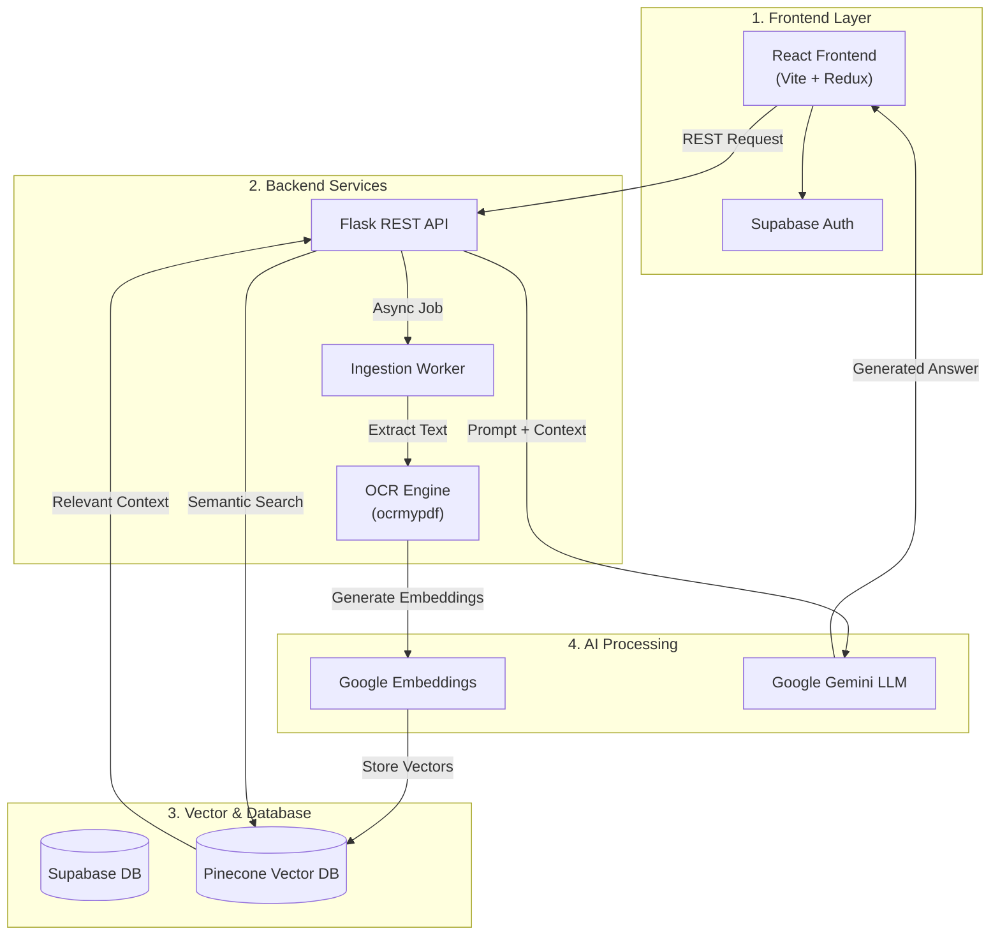

# RAG (Rapid Answer Generator)

## 🚀 Project Overview

RAG (Rapid Answer Generator) is an intelligent web application designed to transform PDF documents into a queryable knowledge base. Users can upload PDFs, perform optical character recognition (OCR) on scanned files, and ask context-aware questions with instant AI-driven answers. The architecture features background ingestion, retention management, vector embeddings, and full container support. The project has recently migrated its authentication and backend-as-a-service from Appwrite to Supabase, as reflected in the current "repomix-output.xml" structure.

---

## ✨ Features

* **Advanced PDF Processing**: Upload PDF documents (up to 2 files, max 5MB each) with automatic text extraction.
* **OCR Integration**: Performs automated OCR on scanned PDFs using `ocrmypdf` to guarantee text extractability.
* **Retrieval-Augmented Generation (RAG)**: Text is chunked, converted into vector embeddings via Google's models, and stored in PineconeDB for fast context retrieval.
* **Background Workers**: Dedicated background worker scripts (`ingestion_worker.py`) and retention policies (`retention.py`) manage asynchronous document processing and cleanup.
* **Context-Aware Chat & Voice**: Retains conversation history to answer queries in context, with automatic fallback to Google Gemini for general knowledge questions. Speech recognition API integration allows hands-free voice search via the `useSpeech.js` hook.
* **Authentication & Usage Limits**: Integration with Supabase auth services (`auth.js`) manages user access, replacing the previous Appwrite integration.
* **Modular Architecture**: Restructured modular Python backend (`server/api/`) organizing AI services, user management, and vector storage.
* **Modern Responsive Interface**: React, Vite, Tailwind CSS, and shadcn/ui frontend managed with Redux Toolkit.
* **Containerization**: Standardized deployment setup provided via a root `Dockerfile`.

---

## 🛠️ Tech Stack

| Layer | Technologies |
| --- | --- |
| **Frontend** | React, Vite, Tailwind CSS, shadcn/ui, Redux Toolkit, React Router DOM, Lucide React |
| **Backend** | Flask (Python), LangChain, Pinecone, PyPDFLoader, `ocrmypdf`<br> |
| **AI & Embeddings** | Google Gemini API & Google Vector Embeddings |
| **Services & Workers** | Supabase Auth, Ingestion Worker, Retention Service |
| **DevOps** | Docker |

---

## 🏗️ Architecture

Below is a high-level overview of the RAG application's architecture:



```mermaid
flowchart TD
    subgraph Client ["1. Frontend Layer"]
        UI["React Frontend\n(Vite + Redux)"]
        Auth["Supabase Auth"]
    end

    subgraph Backend ["2. Backend Services"]
        API["Flask REST API"]
        Worker["Ingestion Worker"]
        OCR["OCR Engine\n(ocrmypdf)"]
    end

    subgraph Storage ["3. Vector & Database"]
        DB[(Supabase DB)]
        Pinecone[("Pinecone Vector DB")]
    end

    subgraph AI ["4. AI Processing"]
        Embed["Google Embeddings"]
        Gemini["Google Gemini LLM"]
    end

    %% Flow Connections
    UI --> Auth
    UI -->|"REST Request"| API
    API -->|"Async Job"| Worker
    Worker -->|"Extract Text"| OCR
    OCR -->|"Generate Embeddings"| Embed
    Embed -->|"Store Vectors"| Pinecone
    API -->|"Semantic Search"| Pinecone
    Pinecone -->|"Relevant Context"| API
    API -->|"Prompt + Context"| Gemini
    Gemini -->|"Generated Answer"| UI
```

## 📺 Demo Video

Watch a quick demonstration of RAG in action, from setting up to querying your documents:

[](https://screenrec.com/share/U7RV108Ovx)

## 📁 Project Structure

The following structure highlights the project structure:

```text
├── Dockerfile
├── README.md
├── client/
│   ├── public/
│   ├── src/
│   │   ├── components/
│   │   ├── config/
│   │   ├── hooks/
│   │   ├── lib/
│   │   ├── pages/
│   │   ├── redux/
│   │   ├── supabase(service)/
│   │   └── utils/
│   ├── package.json
│   ├── App.jsx
│   ├── Main.jsx
│   └── .env
│   
└── server/
    ├── api/
    │   ├── ai_service.py
    │   ├── auth.py
    │   ├── documents.py
    │   ├── ingestion_worker.py
    │   ├── retention.py
    │   ├── routes.py
    │   ├── user_service.py
    │   └── vector_store.py
    ├── app.py
    ├── requirements.txt
    └── .env
```

## 🚀 Getting Started

### Prerequisites

* Node.js (v18 or higher)
* Python (v3.9 or higher)
* npm or Yarn
* `ocrmypdf` (installed via `pip install ocrmypdf` or system package manager)
* Docker (optional, for containerized execution)

---

### 1. Clone the Repository

```bash
git clone https://github.com/owaismohammed79/RAG
cd RAG
```

---

### 2. Backend Setup (Flask Server)

Navigate to the `server` directory:

```bash
cd server
```

Create a Python virtual environment and activate it:

```bash
# On Windows
python -m venv venv
.\venv\Scripts\activate

# On macOS/Linux
python3 -m venv venv
source venv/bin/activate
```

Install the required Python packages:

```bash
pip install -r requirements.txt
```

Create a `.env` file in the `server` directory by copying `.env.sample` and fill in your credentials:

```
# server/.env
GOOGLE_API_KEY=
PINECONE_API_KEY=
PINECONE_INDEX_NAME=
FRONTEND_URL=
MAX_FILE_BYTES=
MAX_CHUNKS_PER_DOC=
DOCS_KEEP_PER_USER=
DOCS_MAX_AGE_DAYS=
CHUNK_CAP_PER_USER=
ADMIN_TOKEN=
SUPABASE_URL=
SUPABASE_SERVICE_ROLE_KEY=
```

Run the Flask server:

```bash
flask run
```

### 3. Frontend Setup (React Vite)

Open a new terminal and navigate to the `client` directory:

```bash
cd client
```

Install the Node.js dependencies:

```bash
npm install
```

Create a `.env` file in the `client` directory by copying `.env.sample` and fill in your credentials:

```
# client/.env
VITE_GOOGLE_OAUTH_CLIENT_ID = 
VITE_EMAIL_ADDRESS = 
VITE_BACKEND_URL=
VITE_BASE_URL=
VITE_SUPABASE_URL=
VITE_SUPABASE_PUBLISHABLE_KEY=
```

Start the React development server:

```bash
npm run dev
```

---

### 4. Docker Deployment

To run the application inside a container:

```bash
docker build -t rag-application .
docker run -p 5000:5000 rag-application
```

---

## 🤝 Contributing

1. Fork the repository.
2. Create a new feature branch (`git checkout -b feature/your-feature-name`).
3. Commit your changes (`git commit -m 'Add new feature'`).
4. Push to the branch (`git push origin feature/your-feature-name`).
5. Open a Pull Request.